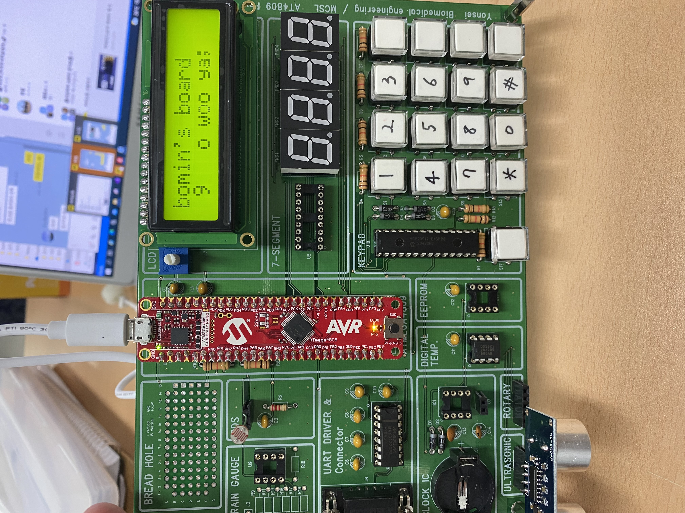

# ⚙️ ATmega4809 Peripheral Driver & Control Board

> **마이크로컴퓨터시스템 수업 실습 프로젝트**  
> ATmega4809 기반 커스텀 보드 직접 납땜 + 디바이스 드라이버 구현

<br>


---

## 📌 프로젝트 개요

연세대학교 의공학부 **마이크로컴퓨터시스템** 수업에서 진행한 실습 프로젝트입니다.  
회로도를 직접 해석하고 **납땜부터 펌웨어 까지** 전 과정을 수행했습니다.

GPIO · 통신 인터페이스 · 주변장치 제어까지, 모든 드라이버를 **외부 라이브러리 없이 직접 구현**하며  
MCU 동작 원리와 레지스터 수준의 하드웨어 제어를 실습했습니다.

| 항목 | 내용 |
|------|------|
| MCU | ATmega4809 (AVR, 8-bit) |
| 보드 | 커스텀 PCB — 직접 납땜 |
| 개발 환경 | Microchip Studio |
| 구현 방식 | Bare-metal (레지스터 직접 제어) |

---

## 🔧 하드웨어 구성

### 탑재 주변장치

| 모듈 | 드라이버 파일 | 설명 |
|------|-------------|------|
| LCD (16×2) | `main.c` | 문자 출력 |
| 7-Segment (4자리) | `main.c` | 숫자 디스플레이 |
| Keypad (4×3) | `main.c` | 키 입력 처리 |
| Stepper Motor | `stepMotor.c/h` | 스텝 모터 구동 |
| Rotary Switch | `rotarysw.c/h` | 로터리 인코더 입력 |
| RTC | `PCF8563.c/h` | 실시간 시계 (I2C) |
| 온도 센서 | `ds1621.c/h` | 디지털 온도 측정 (I2C) |
| External EEPROM | `D24FC512.c/h` | 512Kbit 외부 메모리 (I2C) |
| ADC | `adc.c/h` | 아날로그 센서 수집 |
| UART | `uart.c/h` | 시리얼 통신 |

### 보드 사진


```

```

---

## ⚙️ 핵심 구현

### 1. 직접 구현한 통신 드라이버

외부 라이브러리 없이 AVR 레지스터를 직접 조작하여 구현했습니다.

```
SPI  (spi.c)  — ADS 등 고속 데이터 인터페이스
TWI  (twi.c)  — I2C 기반 센서/EEPROM 통신
UART (uart.c) — 시리얼 디버깅 및 데이터 출력
```

### 2. I2C 기반 다중 센서 연동

TWI 드라이버 위에서 PCF8563(RTC), DS1621(온도), D24FC512(EEPROM)를  
동일한 버스에서 슬레이브 주소로 구분하여 독립 제어했습니다.

### 3. Stepper Motor 제어

스텝 모터의 여자 시퀀스를 직접 정의하고 GPIO로 구동했습니다.  
속도 조절은 delay 타이밍으로 구현했습니다.

---

## 📁 파일 구조

```
atmega4809_project/
├── main.c              # 메인 루프 및 LCD · 7-Seg · Keypad 제어
├── spi.c / spi.h       # SPI 드라이버
├── twi.c / twi.h       # I2C(TWI) 드라이버
├── uart.c / uart.h     # UART 드라이버
├── adc.c / adc.h       # ADC 드라이버
├── stepMotor.c / .h    # 스테퍼 모터 드라이버
├── rotarysw.c / .h     # 로터리 스위치 드라이버
├── PCF8563.c / .h      # RTC 드라이버 (I2C)
├── ds1621.c / .h       # 온도 센서 드라이버 (I2C)
└── D24FC512.c / .h     # 외부 EEPROM 드라이버 (I2C)
```

---

## 💡 배운 점

- 회로도 해석 → 납땜 → 펌웨어 작성까지 **하드웨어-소프트웨어 전 과정** 직접 경험
- 레지스터 수준에서 SPI · I2C · UART를 구현하며 **통신 프로토콜 동작 원리** 체득
- 다양한 주변장치 드라이버를 직접 작성하며 **디바이스 드라이버 설계 패턴** 입문

---

## 👤 개발자

| | |
|---|---|
| **이름** | 서보민 (Bromine) |
| **GitHub** | [@bromine1997](https://github.com/bromine1997) |
| **포트폴리오** | [bromine1997.github.io/web-porfolio](https://bromine1997.github.io/web-porfolio) |
